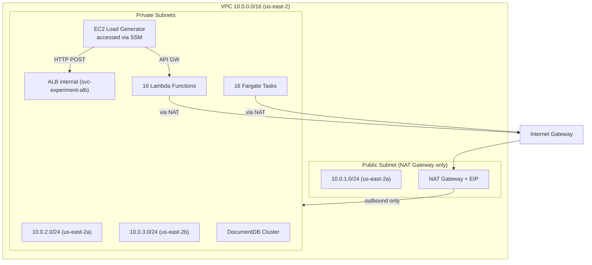
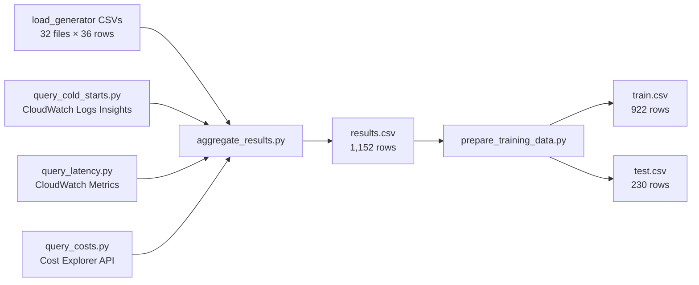

# Design Document: Serverless Container Benchmark

## Overview

This design describes the complete experiment platform for comparing AWS Lambda (serverless) vs. ECS Fargate (container) performance and cost. The platform deploys 32 parallel endpoints across 4 workload archetypes, runs a 7-day load generation campaign producing 1,152 block-level records, and aggregates the results into a training dataset for four regression models.

The system is implemented as a collection of imperative AWS CLI bash scripts and Python utilities — no IaC (Terraform/CDK/CloudFormation). All resources are deployed in **us-east-2** using the naming convention `svc-{archetype}-{memory}-{imagesize}-{serverless|container}`.

### Key Design Decisions

1. **No IaC** — All infrastructure is provisioned via sequential AWS CLI scripts sourcing a shared `experiment-env.sh` state file.
2. **DocumentDB only** — Enterprise Microservice uses Amazon DocumentDB (MongoDB-compatible) as its sole backing store. No Redis/Elasticache.
3. **wrk2 subprocess** — Enterprise Microservice load generation uses wrk2 invoked as a subprocess from the main `load_generator.py`, not a separate process.
4. **Region: us-east-2** — All resources, CLI commands, and endpoint URLs target us-east-2.
5. **Naming: `svc-` prefix** — Resources use `svc-` prefix with `-serverless`/`-container` suffixes (not `sebs-`/`-lambda`/`-fargate`).
6. **Guide file updates** — The 8 existing markdown guides (01–09) must be updated to reflect the new naming convention and region before implementation.
7. **Private ingress + NAT Gateway for egress** — All resources (ALB, Lambda, Fargate, DocumentDB, EC2) are in private subnets with no public inbound access. A single public subnet hosts only the NAT Gateway + IGW for outbound internet access to AWS services (S3, ECR, CloudWatch, STS). The EC2 load generator is accessed via SSM Session Manager. The ALB is internal.
8. **Handler fidelity** — Handler code preserves original benchmark logic. Python rewrite for enterprise-microservice is required to eliminate language as a confounding variable.

### Reference Files

The design builds upon 8 existing markdown guide files containing reference implementations:

| File | Content | Gaps to Address |
|---|---|---|
| `01_02_context_and_variables.md` | Context, variables, configuration space | Region says us-east-1 → update to us-east-2 |
| `03_workload_archetypes.md` | 4 archetype definitions, payload tiers | Archetype names use old convention |
| `04_infrastructure.md` | VPC, IAM, S3, ECR, ECS, ALB setup | Region/naming throughout; missing DocumentDB |
| `05_build_images.md` | Dockerfiles, handler.py (Thumbnailer only), payloads | Missing handlers for ETL, ML Inference, Enterprise Microservice |
| `06_deployment.md` | Lambda + Fargate deployment scripts | Region/naming; ECR repo path uses old convention |
| `07_load_generator.md` | Complete load_generator.py, wrk2 integration | Region/naming in deployment names |
| `08_running_experiments.md` | Pre-flight checklist, monitoring commands | Region/naming references |
| `09_to_11_collect_prepare_cleanup.md` | Data collection, aggregation, cleanup | Region/naming; function name lists use old convention |

### Reference Benchmark Repositories

The following upstream benchmark repositories are available locally for implementation reference:

- `../serverless-benchmarks/` — [SeBS: Serverless Benchmark Suite](https://github.com/spcl/serverless-benchmarks). Contains the `thumbnailer` and `ml-inference` reference implementations.
- `../DeathStarBench/` — [DeathStarBench](https://github.com/delimitrou/DeathStarBench). Contains the `enterprise-microservice` (hotel-reservation) Go microservice stack we adapt.

## Architecture

### System Architecture Diagram

```mermaid
graph TB
    subgraph EC2["EC2 c5.2xlarge (us-east-2)"]
        LG[load_generator.py<br/>32 threads]
        WRK2[wrk2 subprocess<br/>Enterprise Microservice only]
        LG -->|subprocess| WRK2
    end

    subgraph Lambda["AWS Lambda (16 functions)"]
        APIGW[API Gateway HTTP APIs<br/>POST /invoke, GET /health]
        LF1[svc-event-driven-api-*-serverless]
        LF2[svc-batch-transform-*-serverless]
        LF3[svc-ml-inference-*-serverless]
        LF4[svc-enterprise-microservice-*-serverless]
        APIGW --> LF1 & LF2 & LF3 & LF4
    end

    subgraph Fargate["ECS Fargate (16 services)"]
        ALB[ALB internal path-based routing<br/>/{svc-name}*/]
        FS1[svc-event-driven-api-*-container]
        FS2[svc-batch-transform-*-container]
        FS3[svc-ml-inference-*-container]
        FS4[svc-enterprise-microservice-*-container]
        ALB --> FS1 & FS2 & FS3 & FS4
    end

    subgraph Storage["Shared Services"]
        S3[(S3 Bucket<br/>svc-experiment-data)]
        DOCDB[(DocumentDB<br/>Enterprise Microservice)]
    end

    subgraph Metrics["Metrics Collection"]
        CW[CloudWatch Logs/Metrics]
        CE[Cost Explorer]
    end

    LG -->|HTTP POST| APIGW
    LG -->|HTTP POST| ALB
    WRK2 -->|HTTP| ALB
    WRK2 -->|HTTP| APIGW
    LF1 & LF2 & LF3 & FS1 & FS2 & FS3 --> S3
    LF4 & FS4 --> DOCDB
    LF1 & LF2 & LF3 & LF4 --> CW
    FS1 & FS2 & FS3 & FS4 --> CW
```

### Network Architecture



> **Network design**: All resources are in private subnets with no public inbound access. The public subnet exists solely to host the NAT Gateway, which provides outbound-only internet access for AWS service calls (S3, ECR, CloudWatch, SSM). The IGW supports the NAT Gateway — no resources have public IPs or are directly internet-accessible.

### Execution Flow

Each of the 32 deployments runs 36 sequential blocks:

```
For each deployment (32 in parallel):
  For freq in [1k, 10k, 50k, 100k]:
    For cv in [0.5, 2.0, 4.0]:
      For duration_tier in [small, medium, large]:  # ~500ms / ~2s / ~5s execution durations
        → 90 min active load (Gamma-distributed inter-arrivals)
        → 15 min idle (Lambda env recycling)
        → Write 1 row to per-deployment CSV
```

Total: 32 × 36 = 1,152 block-level records.

## Components and Interfaces

### Component 1: Infrastructure Scripts

A set of bash scripts that provision all AWS resources. Each script sources `experiment-env.sh` and appends new resource IDs to it.

| Script | Purpose | Creates |
|---|---|---|
| `01_setup_vpc.sh` | VPC, public subnet (NAT GW only), private subnets, IGW, NAT GW, security group | VPC, 3 subnets, route tables, SG, NAT GW |
| `02_setup_iam.sh` | IAM roles for Lambda and Fargate | 2 IAM roles with policies |
| `03_setup_storage.sh` | S3 bucket, ECR repositories | 1 S3 bucket, 4 ECR repos |
| `04_setup_ecs_alb.sh` | ECS cluster, internal ALB, default listener | 1 ECS cluster, 1 internal ALB |
| `05_setup_docdb.sh` | DocumentDB subnet group, cluster, instance | 1 DocumentDB cluster |

All scripts follow the pattern:
```bash
#!/bin/bash
set -euo pipefail
source experiment-env.sh
# ... create resources ...
echo "RESOURCE_ID=$RESOURCE_ID" >> experiment-env.sh
```

### Component 2: Workload Handlers

Four `handler.py` files, one per archetype, each implementing the dual-entrypoint pattern (Lambda `handler()` + Fargate Flask server):

#### Handler Code Fidelity Principle

Handler code should stay as close to the original reference implementation as possible. Avoid unnecessary rewrites — only adapt what's needed for the Lambda/Fargate dual-entrypoint pattern.

- For archetypes 1–3 (event-driven-api, batch-transform, ml-inference — sourced from SeBS, already Python): keep the original logic, just wrap with our handler interface.
- For archetype 4 (enterprise-microservice — sourced from DeathStarBench, originally Go): a Python rewrite is necessary because Lambda container images require a single runtime, and using the same language across all archetypes eliminates language as a confounding variable in the regression models. The Python implementation should mirror the original Go logic as closely as possible — same algorithms, same data structures, same query patterns.

```
archetypes/
├── thumbnailer/
│   ├── handler.py              # Exists in 05_build_images.md
│   ├── requirements-slim.txt
│   └── requirements-standard.txt
├── etl-pipeline/
│   ├── handler.py              # NEW — must be built
│   ├── requirements-slim.txt
│   └── requirements-standard.txt
├── ml-inference/
│   ├── handler.py              # NEW — must be built
│   ├── requirements-slim.txt
│   └── requirements-standard.txt
└── hotel-reservation/
    ├── handler.py              # NEW — must be built
    ├── requirements-slim.txt
    └── requirements-standard.txt
```

#### `thumbnailer` Handler Design (archetype: `event-driven-api`)

The handler is based on the SeBS 210.thumbnailer benchmark.

**Reference implementation:** `../serverless-benchmarks/benchmarks/200.multimedia/210.thumbnailer/python/function.py`
- The SeBS implementation does a simple resize using Pillow's `Image.thumbnail()` and uploads the result to storage.
- The SeBS code uses a custom `storage` abstraction — we replace this with direct `boto3` S3 calls.
- Our handler builds on this by adding tiered complexity: small=resize only, medium=resize + format conversion + EXIF extraction, large=resize + multi-format compression with 9 variants + watermarking.

#### Handler Interface Contract

Every handler exposes the same interface regardless of archetype:

```python
# Lambda entrypoint
def handler(event, context=None) -> dict:
    """
    Args:
        event: JSON payload with 'payload_tier' and archetype-specific fields
    Returns:
        {'statusCode': 200, 'body': json.dumps({...})}
    """

# Fargate entrypoint (conditional on PLATFORM env var)
if PLATFORM == 'fargate':
    app = Flask(__name__)
    @app.route('/invoke', methods=['POST'])  # → calls handler(request.get_json())
    @app.route('/health', methods=['GET'])   # → returns {'status': 'healthy'}
```

#### `etl-pipeline` Handler Design (archetype: `batch-transform`)

Based on the SeBS-Flow ETL pipeline pattern (Copik et al., arXiv 2410.03480v2), the handler performs CSV ingestion, cleaning, aggregation, and optional Parquet export:

```python
def process(payload_tier: str, s3_key: str) -> dict:
    # Download CSV from S3
    # Small: 10K rows, single-column aggregation (group by category, sum value_a)
    # Medium: 100K rows, multi-column aggregation + type casting + null handling
    # Large: 1M rows, full pipeline: ingest + clean + aggregate + Parquet export to S3
    # Returns: row_count, aggregation_results, execution_ms
```

Dependencies: `pandas`, `pyarrow` (for Parquet), `boto3`, `flask`

#### `ml-inference` Handler Design (archetype: `ml-inference`)

Based on the SeBS 411.image-recognition benchmark ([source](https://github.com/spcl/serverless-benchmarks/blob/master/benchmarks/400.inference/411.image-recognition/python/function.py)), the handler loads a pre-trained model and runs image classification.

**Reference implementation:** `../serverless-benchmarks/benchmarks/400.inference/411.image-recognition/python/function.py`
- The SeBS implementation uses ResNet-50 with torchvision transforms: `Resize(256)`, `CenterCrop(224)`, `ToTensor`, `Normalize` — we follow the same preprocessing pipeline.
- The model is loaded once globally and reused across warm invocations (same pattern we follow).
- The SeBS code downloads the model from S3 on cold start — we bake it into the container image instead to isolate cold start measurement from network variability.
- We extend the SeBS single-image approach by adding batch size control (1/4/8 images) and MobileNetV2 for the small tier.

```python
# Model loaded once on cold start, kept in memory for warm invocations
model = None

def process(payload_tier: str, batch_size: int) -> dict:
    # Small: batch=1, MobileNetV2 (~14MB model)
    # Medium: batch=4, ResNet-50 (~98MB model)
    # Large: batch=8, ResNet-50 (~98MB model)
    # Model baked into container image (not downloaded at runtime)
    # Uses torchvision transforms: Resize(256) → CenterCrop(224) → ToTensor → Normalize
    # Returns: predictions list, execution_ms
```

Dependencies: `torch`, `torchvision`, `Pillow`, `boto3`, `flask`

The standard image variant includes the ResNet-50 weights (~98MB) baked in. The slim variant includes only MobileNetV2 (~14MB). Both models are stored at `/app/models/` in the container.

#### `hotel-reservation` Handler Design (archetype: `enterprise-microservice`)

Simplified 2-service slice from DeathStarBench ([source](https://github.com/delimitrou/DeathStarBench/tree/master/hotelReservation)), re-implemented in Python with DocumentDB as the sole backing store.

**Reference implementation:** `../DeathStarBench/hotelReservation/`
- The original is a Go microservice stack using gRPC, MongoDB, Memcached, and Consul service discovery.
- Services in the original: search, geo, rate, profile, recommendation, reservation, user, frontend.
- We re-implement a simplified 2-service slice (search + reservation) in Python with Flask.
- We use DocumentDB (MongoDB-compatible) as the sole backing store — no Memcached/Redis.
- The original search service calls geo (nearby hotels) then rate (pricing) — we collapse this into a single DocumentDB query with geo-proximity.
- The original reservation service uses MongoDB transactions for booking — we replicate this with `pymongo` transactions.
- Seed data available in the repo: `data/hotels.json`, `data/inventory.json`, `data/geo.json`.

```python
def process(payload_tier: str, operation: str) -> dict:
    # Connects to DocumentDB via DOCDB_ENDPOINT env var
    # search-only: GET /hotels — query hotels collection, geo-proximity filter
    # search+recommendation: GET /recommendations — query + scoring algorithm
    # full-booking: POST /reservation — search + recommend + auth + write reservation
    # Returns: operation result, execution_ms
```

The handler exposes three additional routes for wrk2 compatibility:
- `GET /hotels` — search endpoint
- `GET /recommendations` — recommendation endpoint  
- `POST /reservation` — booking endpoint

Dependencies: `pymongo`, `boto3`, `flask`

### Component 3: Container Image Build System

Multi-stage Dockerfiles producing 16 images (4 archetypes × 2 sizes × 2 platforms):

```
Tag pattern: {platform}-{size}
  serverless-slim, serverless-standard, container-slim, container-standard

ECR path: {ACCOUNT_ID}.dkr.ecr.us-east-2.amazonaws.com/svc-experiment/{archetype}:{tag}

Where `{archetype}` uses the canonical names: `event-driven-api`, `batch-transform`, `ml-inference`, `enterprise-microservice`.

The build script iterates all 4 archetypes and builds/pushes all 4 variants per archetype.

### Component 4: Deployment Scripts

| Script | Purpose | Creates |
|---|---|---|
| `deploy_lambda.sh` | Deploy 16 Lambda functions + API Gateway HTTP APIs | 16 functions, 16 APIs |
| `deploy_fargate.sh` | Deploy 16 Fargate services + ALB target groups/rules | 16 services, 16 TGs |
| `generate_deployments_json.py` | Convert `endpoints.txt` → `deployments.json` | 1 JSON config file |
| `validate_endpoints.py` | Health check all 32 endpoints | Pass/fail report |

### Component 5: Load Generator

`load_generator.py` — the central orchestrator running on EC2:

- Launches 32 threads (one per deployment), staggered by 0.5s
- Each thread runs 36 blocks sequentially: 4 frequencies × 3 CVs × 3 duration tiers
- Uses Gamma distribution for inter-arrival times: `shape = 1/CV², scale = mean_interval/shape`
- For `enterprise-microservice` archetype: invokes wrk2 as subprocess instead of Python HTTP client
- Writes per-deployment CSV files with one row per block
- Accepts `--config` (deployments.json) and `--output` (directory) CLI args

### Component 6: Data Collection Pipeline



### Component 7: Cleanup Script

`cleanup.sh` — deletes all resources in reverse dependency order:
1. Lambda functions + API Gateways
2. ECS services + task definitions
3. ALB target groups + ALB
4. DocumentDB cluster + subnet group
5. ECR repositories
6. S3 bucket
7. NAT Gateway + EIP + IGW
8. Public subnet + private subnets + route tables + security group + VPC
9. IAM roles
10. EC2 instance + instance profile

## Data Models

### experiment-env.sh (Shared State)

All infrastructure scripts append resource IDs to this file. Every subsequent script sources it.

```bash
# VPC
VPC_ID=vpc-xxx
SUBNET_PUB_A=subnet-xxx
SUBNET_PRIV_A=subnet-xxx
SUBNET_PRIV_B=subnet-xxx
SG_ID=sg-xxx
IGW_ID=igw-xxx
NAT_GW=nat-xxx
EIP_ALLOC=eipalloc-xxx
PUBLIC_RT=rtb-xxx
PRIVATE_RT=rtb-xxx

# IAM
LAMBDA_ROLE_ARN=arn:aws:iam::xxx:role/svc-lambda-execution-role
FARGATE_ROLE_ARN=arn:aws:iam::xxx:role/svc-fargate-execution-role

# Storage
BUCKET_NAME=svc-experiment-data-{ACCOUNT_ID}
ACCOUNT_ID=xxx
ECR_REGISTRY={ACCOUNT_ID}.dkr.ecr.us-east-2.amazonaws.com

# ECS/ALB
ALB_ARN=arn:aws:elasticloadbalancing:us-east-2:xxx
ALB_DNS=svc-experiment-alb-xxx.us-east-2.elb.amazonaws.com
LISTENER_ARN=arn:aws:elasticloadbalancing:us-east-2:xxx

# DocumentDB
DOCDB_ENDPOINT=svc-experiment-docdb.cluster-xxx.us-east-2.docdb.amazonaws.com
```

### endpoints.txt

```
svc-event-driven-api-512mb-slim-serverless=https://{API_ID}.execute-api.us-east-2.amazonaws.com/prod/invoke
svc-event-driven-api-512mb-slim-container=http://{ALB_DNS}/svc-event-driven-api-512mb-slim-container/invoke
...
```

### deployments.json

```json
[
  {
    "name": "svc-event-driven-api-512mb-slim-serverless",
    "url": "https://{API_ID}.execute-api.us-east-2.amazonaws.com/prod/invoke",
    "archetype": "event-driven-api",
    "platform": "lambda",
    "memory_mb": 512,
    "image_size": "slim"
  }
]
```

### Deployment Matrix (32 entries)

| Dimension | Values | Count |
|---|---|---|
| Archetype | event-driven-api, batch-transform, ml-inference, enterprise-microservice | 4 |
| Memory | 512mb, 2gb | 2 |
| Image Size | slim, standard | 2 |
| Platform | serverless (Lambda), container (Fargate) | 2 |
| **Total** | 4 × 2 × 2 × 2 | **32** |

### Block Parameters (36 per deployment)

| Dimension | Values | Count |
|---|---|---|
| Invocation Frequency | 1k, 10k, 50k, 100k | 4 |
| Traffic CV | 0.5, 2.0, 4.0 | 3 |
| Duration Tier | small, medium, large | 3 |
| **Total** | 4 × 3 × 3 | **36** |

### Per-Block CSV Row Schema

| Column | Type | Description |
|---|---|---|
| `deployment_name` | string | e.g., `svc-event-driven-api-512mb-slim-serverless` |
| `archetype` | string | event-driven-api / batch-transform / ml-inference / enterprise-microservice |
| `platform` | string | lambda / fargate |
| `memory_mb` | int | 512 / 2048 |
| `image_size` | string | slim / standard |
| `block_index` | int | 1–36 |
| `invocation_frequency` | string | 1k / 10k / 50k / 100k |
| `traffic_cv` | float | 0.5 / 2.0 / 4.0 |
| `duration_tier` | string | small / medium / large |
| `block_start_utc` | ISO datetime | UTC timestamp |
| `total_requests` | int | Requests sent in 90-min block |
| `error_count` | int | Non-200 or timeout count |
| `error_rate_pct` | float | error_count / total_requests × 100 |
| `p50_latency_ms` | float | 50th percentile latency |
| `p95_latency_ms` | float | 95th percentile latency |
| `p99_latency_ms` | float | 99th percentile latency |
| `mean_latency_ms` | float | Mean latency |
| `throughput_rps` | float | total_requests / 5400 |

### results.csv Final Schema (1,152 rows)

Adds to the per-block schema:
- `image_size_mb`: int (slim=50, standard=250)
- `state_management`: int (enterprise-microservice=1, others=0)
- `cold_start_rate_pct`: float (Lambda only; 0 for Fargate)
- `cold_start_duration_ms`: float (Lambda only; 0 for Fargate)

### DocumentDB Data Model (Enterprise Microservice)

```
Database: hotel_reservation

Collections:
  hotels:
    { _id, hotelId, name, lat, lon, rate, type, description, rooms_available }

  users:
    { _id, username, password_hash }

  reservations:
    { _id, hotelId, customerName, inDate, outDate, roomNumber, created_at }
```

### S3 Payload Structure

```
s3://svc-experiment-data-{ACCOUNT_ID}/
├── payloads/
│   ├── event-driven-api/
│   │   ├── small/sample.jpg      (~50KB)
│   │   ├── medium/sample.png     (~500KB)
│   │   └── large/sample.tiff     (~2MB)
│   ├── batch-transform/
│   │   ├── small/data.csv        (10K rows)
│   │   ├── medium/data.csv       (100K rows)
│   │   └── large/data.csv        (1M rows)
│   └── ml-inference/
│       ├── small/test_image.jpg
│       ├── medium/test_images/    (4 images)
│       └── large/test_images/     (8 images)
```

## Correctness Properties

*A property is a characteristic or behavior that should hold true across all valid executions of a system — essentially, a formal statement about what the system should do. Properties serve as the bridge between human-readable specifications and machine-verifiable correctness guarantees.*

### Property 1: Experiment-env.sh Round-Trip Persistence

*For any* set of key-value pairs representing AWS resource IDs (VPC IDs, subnet IDs, ARNs, endpoint URLs), writing them to `experiment-env.sh` in `KEY=VALUE` format and then sourcing/parsing the file back should recover all original key-value pairs with identical values.

**Validates: Requirements 1.7, 2.5, 3.3, 4.4, 5.3**

### Property 2: Deployment Naming Convention Round-Trip

*For any* valid combination of (archetype, memory, image_size, platform_suffix), generating a deployment name using the pattern `svc-{archetype}-{memory}-{imagesize}-{platform_suffix}` and parsing it back should recover the original archetype, memory_mb, image_size, and platform. Additionally, the suffix `serverless` must map to platform `lambda` and `container` must map to platform `fargate`.

**Validates: Requirements 9.1, 10.1, 12.1, 12.3**

### Property 3: Handler Interface Invariant

*For any* valid archetype and any valid payload for that archetype's tier, invoking the handler should return a response with `statusCode` 200 and a JSON body containing at minimum `payload_tier` and `execution_ms` fields, where `execution_ms` is a non-negative number.

**Validates: Requirements 6.1, 6.2, 6.3, 6.4**

### Property 4: ETL Data Generation Schema and Distribution

*For any* generated ETL CSV dataset (regardless of row count), the output should contain exactly the columns `id`, `value_a`, `value_b`, `category`, `region`, `status`; the `category` values should be drawn from {A, B, C, D, E}; the `region` values from {us-east, us-west, eu-west}; and the `status` distribution should approximate 70% active, 20% inactive, 10% pending (within statistical tolerance for the given sample size).

**Validates: Requirements 8.2, 8.3**

### Property 5: Gamma Distribution Inter-Arrival Times

*For any* valid (rate_per_second, cv) pair where rate_per_second > 0 and cv > 0, generating N inter-arrival times using the Gamma distribution with shape=1/cv² and scale=(1/rate_per_second)/shape should produce samples whose empirical mean approximates 1/rate_per_second and whose empirical CV (std/mean) approximates the target cv, both within statistical tolerance for sample size N.

**Validates: Requirements 13.1, 13.2, 13.3, 13.4**

### Property 6: Block Parameter Completeness

*For any* deployment, the block parameter generator iterating over 4 frequencies × 3 CV levels × 3 duration tiers should produce exactly 36 unique (frequency, cv, duration_tier) tuples, with no duplicates and no missing combinations.

**Validates: Requirements 14.1**

### Property 7: Payload Tier Mapping Completeness

*For any* valid (archetype, duration_tier) pair where archetype is one of {event-driven-api, batch-transform, ml-inference, enterprise-microservice} and duration_tier is one of {small, medium, large}, the payload lookup should return a non-empty dict containing at minimum a `payload_tier` key matching the input tier. For enterprise-microservice, the Lua script mapping should also return a valid file path for each tier.

**Validates: Requirements 14.4, 16.2**

### Property 8: CSV Block Row Round-Trip

*For any* valid block summary dictionary containing all 18 required columns (deployment_name, archetype, platform, memory_mb, image_size, block_index, invocation_frequency, traffic_cv, duration_tier, block_start_utc, total_requests, error_count, error_rate_pct, p50_latency_ms, p95_latency_ms, p99_latency_ms, mean_latency_ms, throughput_rps), writing the row to a CSV file and reading it back should preserve all field names and values (accounting for string/numeric type coercion).

**Validates: Requirements 15.2, 15.3, 16.5**

### Property 9: wrk2 Latency Parsing

*For any* wrk2 output line containing a latency percentile value in microseconds (us), milliseconds (ms), or seconds (s), the parser should correctly convert the value to milliseconds. Specifically: a value ending in "us" should be divided by 1000, "ms" should be unchanged, and "s" should be multiplied by 1000.

**Validates: Requirements 16.4**

### Property 10: Fargate Memory-to-CPU Mapping

*For any* valid memory level in the experiment (512 or 2048 MB), the Fargate task definition mapping should produce the correct CPU units and task memory: 512MB → (512 CPU, 1024 MEM) and 2048MB → (2048 CPU, 4096 MEM).

**Validates: Requirements 10.2, 10.3**

### Property 11: Results Aggregation Invariants

*For any* complete set of load generator CSVs (32 deployments × 36 blocks each) and corresponding cold start data, the aggregator should: (a) produce exactly 1,152 rows; (b) for every row where platform=fargate, set cold_start_rate_pct=0.0 and cold_start_duration_ms=0.0; (c) for every row where platform=lambda, compute cold_start_rate_pct as (cold_start_count/total_requests)×100; (d) map image_size "slim"→50 and "standard"→250 for image_size_mb; (e) map archetype "enterprise-microservice"→1 and all others→0 for state_management.

**Validates: Requirements 21.1, 21.2, 21.3, 21.4, 21.5**

### Property 12: Feature Engineering Correctness

*For any* valid results row, the derived features should satisfy: invocation_frequency_numeric maps correctly (1k→1000, 10k→10000, 50k→50000, 100k→100000), duration_tier_numeric maps correctly (small→500, medium→2000, large→5000), log_invocations equals the natural logarithm of invocation_frequency_numeric, and sustained_load equals (invocation_frequency_numeric × duration_tier_numeric) / 1e6.

**Validates: Requirements 22.3**

## Error Handling

### Infrastructure Script Errors

- All bash scripts use `set -euo pipefail` to fail fast on any command error
- Each script checks that `experiment-env.sh` exists and contains required variables before proceeding
- AWS CLI commands that create resources capture the resource ID; if the command fails, the script exits before appending to `experiment-env.sh`, preventing partial state

### Handler Errors

- Each handler wraps the `process()` function in a try/except block
- On error, returns `{'statusCode': 500, 'body': json.dumps({'error': str(e)})}`
- S3 download failures are caught and reported with the specific S3 key that failed
- DocumentDB connection failures in Enterprise Microservice include the endpoint in the error message
- ML Inference model loading failures on cold start are logged and return a 500 with model path details

### Load Generator Errors

- Individual request failures (non-200, timeout, connection error) increment the error counter but do not stop the block
- Thread-level exceptions are caught by the thread wrapper; a dying thread does not affect the other 31 threads
- wrk2 subprocess failures (non-zero exit code) are logged and the block is recorded with zero latency values
- If `deployments.json` is malformed, the load generator exits immediately with a clear error message

### Data Collection Errors

- CloudWatch Logs Insights queries that return no results produce a warning but do not fail the script
- Cost Explorer queries handle pagination (NextPageToken) to avoid missing data
- The aggregator warns if the final row count ≠ 1,152 but still writes the partial results
- The training data preparer validates that all required columns exist before splitting

### Cleanup Errors

- Cleanup script uses `|| true` on delete commands to continue even if a resource is already deleted
- NAT Gateway deletion includes a wait/sleep to handle the async deletion before releasing the EIP
- The script warns if `results.csv` has not been confirmed as backed up before proceeding

## Testing Strategy

### Testing Approach

This project uses a dual testing approach:

1. **Property-based tests** — Verify universal properties (the 12 correctness properties above) across many generated inputs using `hypothesis` (Python PBT library). Each property test runs a minimum of 100 iterations.
2. **Unit tests** — Verify specific examples, edge cases, and integration points using `pytest`.
3. **Integration/smoke tests** — Verify AWS resource provisioning and end-to-end flows against real infrastructure.

### Property-Based Testing Configuration

- Library: `hypothesis` for Python
- Minimum iterations: 100 per property
- Each test is tagged with: `# Feature: serverless-container-benchmark, Property {N}: {title}`
- Properties 1–12 map directly to the Correctness Properties section above

### Unit Test Coverage

| Component | Test Focus |
|---|---|
| Handler dispatch | Verify Lambda vs Fargate entrypoint selection based on PLATFORM env var |
| Endpoint validator | Mock HTTP responses (200, 500, timeout) and verify pass/fail classification |
| wrk2 dispatch | Verify enterprise-microservice routes to wrk2, others to Python HTTP |
| CLI argument parsing | Verify all scripts accept required arguments |
| Cost filtering | Verify S3/data transfer costs are excluded |
| Aggregator warnings | Verify warning on row count ≠ 1,152 |

### Integration Test Coverage

| Test | What It Verifies |
|---|---|
| VPC smoke test | VPC, private subnets, VPC endpoints, SG exist with correct configuration |
| IAM smoke test | Roles exist with correct policies attached |
| ECR smoke test | 4 repositories exist with expected image tags |
| DocumentDB smoke test | Cluster accessible from private subnets |
| Endpoint validation | All 32 endpoints return HTTP 200 on health check |
| Single-block dry run | One deployment runs one block successfully and produces a valid CSV row |

### Test Execution Order

1. Run property-based tests and unit tests locally before deploying (no AWS resources needed)
2. Run smoke tests after infrastructure provisioning
3. Run endpoint validation after all 32 deployments
4. Run single-block dry run before starting the full 7-day experiment
